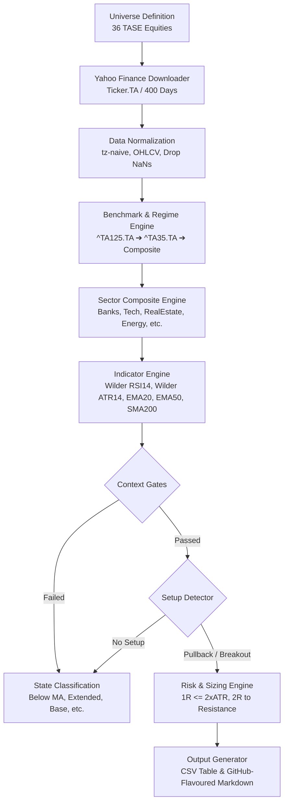

# 01. Architecture & Pipeline

This document explains the technical architecture, data retrieval layer, indicator calculations, and data normalization pipeline used by the **TASE-125** engine.

---

## 🏗️ End-to-End Pipeline

---

## 📊 Data Source & Quirks

### 1. Yahoo Finance (`yfinance`)
All market data is fetched via Yahoo Finance daily bars using the `.TA` suffix:
- Bank Hapoalim: `POLI.TA`
- Bank Leumi: `LUMI.TA`
- Palo Alto Networks (dual-listed): `CYBR.TA` (inherited from CyberArk)

### 2. Quotation Units: Agorot (`ILA`) vs. Shekels (`ILS`)
Most equities on the Tel Aviv Stock Exchange are quoted in **Agorot** (`ILA`), where:
$$100 \text{ Agorot} = 1 \text{ New Israeli Shekel (ILS)}$$

- **Price Levels (Entry, Stop, Target)**: Maintained in the stock's native quote unit (`ILA`) so levels directly match broker order entry screens.
- **Liquidity / Turnover Filter**: Turnover is calculated by converting Agorot to ILS internally:
  $$\text{Turnover} = \text{Close} \times 0.01 \times \text{Volume}$$
  The 20-day simple moving average must meet or exceed the liquidity floor (default: **1,000,000 ILS**).

### 3. Benchmark Fallback Chain
Relative strength and market regime depend on the broad market benchmark. The engine executes a three-tier fallback:
1. `^TA125.TA` (Primary benchmark)
2. `^TA35.TA` (Secondary fallback)
3. **Equal-Weight Composite**: An internally constructed, normalized composite of all universe equities if Yahoo Finance experiences network/quote issues with the index symbols.

---

## 🧮 Mathematical Indicators

### Wilder's RSI (14)
Wilder's RSI uses exponential smoothing with $\alpha = \frac{1}{14}$ rather than standard EMA smoothing ($\alpha = \frac{2}{15}$). This precisely matches TradingView and Israeli broker charts:
$$\text{avg\_gain} = \text{gain} \times \alpha + \text{prior\_avg\_gain} \times (1 - \alpha)$$
$$\text{RSI} = 100 - \frac{100}{1 + \frac{\text{avg\_gain}}{\text{avg\_loss}}}$$

### Wilder's Average True Range (ATR 14)
Accounts for overnight gaps:
$$\text{True Range} = \max(\text{High} - \text{Low}, |\text{High} - \text{Close}_{\text{prev}}|, |\text{Low} - \text{Close}_{\text{prev}}|)$$
Smoothed using Wilder's method with $\alpha = \frac{1}{14}$.
